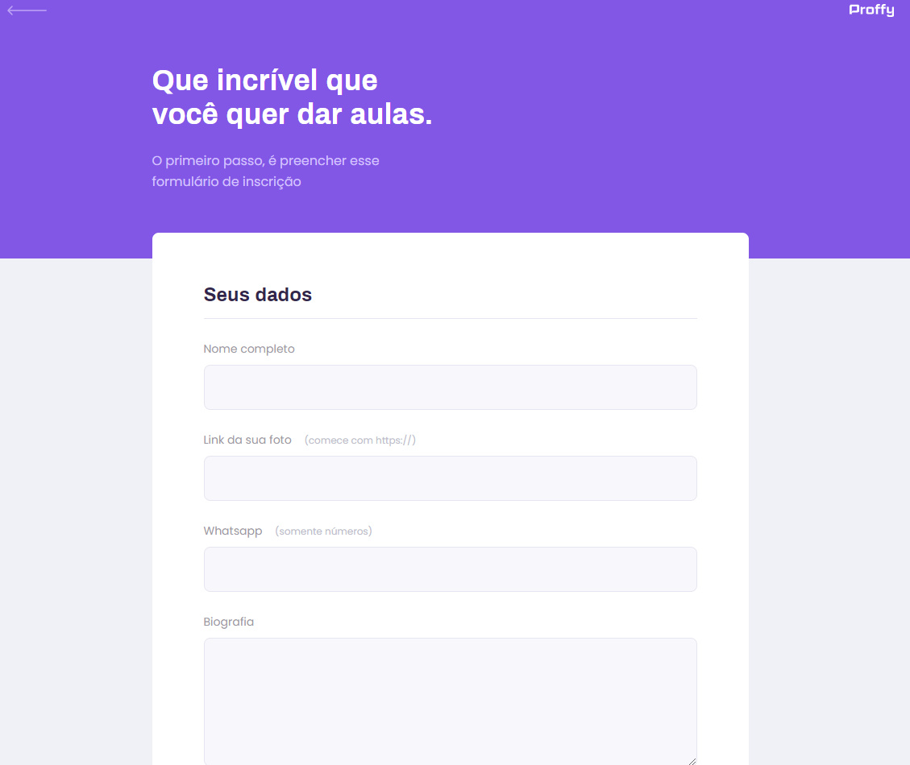

# plataforma-proffys

Projeto desenvolvido com o intuito de conectar professores e estudantes através da plataforma.

A proposta do projeto é uma aplicação que possa ligar quem deseja aprender, com quer ensinar. É possível encontrar alunos para o que você leciona, ou encontrar o professor para aquela matéria que você sempre quis aprender mais! Sem que haja nenhuma limitação de área.

Técnologias Utilizadas:

 - HTML
 - CSS
 - JavaScript
 - Node.js
 - Nunjucks
 - SQLite
 
 Telas:
 
 
 
 

Projeto desenvonvoldido durante semana NLW promovido pela @rocketseat.